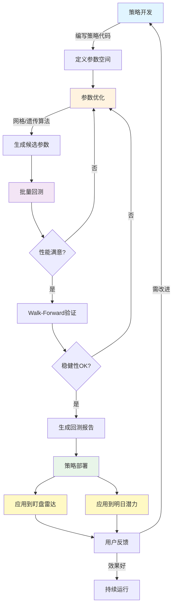

# PRD 补充文档 - 回测系统与参数优化

> 本文档是对现有 PRD《东风破-智能股票量化交易系统》的补充，主要添加回测系统和参数优化功能模块。

---

## 📌 需要在 PRD 中添加的内容

### 1. 在第 4 章"功能需求"中新增 4.2.6 节

#### 4.2.6 回测与参数优化系统 ⭐ 新增

**功能定位**：量化策略开发闭环的核心模块，实现"策略开发 → 参数优化 → 回测验证 → 应用选股"的完整流程。

**闭环设计**：

```
策略开发 → 参数优化 → 回测验证 → (不满意则继续) 参数优化 → 回测验证 → (满意后) 应用到盯盘雷达/明日潜力
```

**核心功能**：

**1. 回测功能**

- [ ] 策略选择（支持多种内置策略）
- [ ] 回测参数配置
  - 时间范围选择
  - 初始资金设置
  - 手续费/滑点配置
- [ ] 回测执行引擎（事件驱动）
- [ ] 性能指标计算
  - 收益指标：年化收益率、总收益率、月度收益
  - 风险指标：最大回撤、夏普比率、索提诺比率
  - 交易指标：胜率、盈亏比、交易次数
- [ ] 回测报告生成（Markdown/HTML/PDF）

**2. 参数优化功能** ⚡ 核心

- [ ] **网格搜索**：适用于参数少的策略（≤3 个参数）
- [ ] **随机搜索**：快速探索参数空间
- [ ] **遗传算法**：智能优化，快速收敛（推荐）
  - 种群大小可配置
  - 迭代代数可配置
  - 交叉、变异参数可调
- [ ] **Walk-Forward 分析**：防止过拟合
  - 滚动窗口训练和测试
  - 样本内外性能对比
- [ ] 多目标优化（收益/风险/胜率综合评分）
- [ ] 优化进度实时显示
- [ ] 优化历史记录

**3. 策略管理**

- [ ] 策略列表展示
- [ ] 策略详情查看（参数、历史表现）
- [ ] 策略启用/禁用
- [ ] 策略版本管理
- [ ] 策略应用范围配置（盯盘雷达/明日潜力）

**4. 策略应用**

- [ ] 优化后的策略自动应用到盯盘雷达
- [ ] 优化后的策略自动应用到明日潜力
- [ ] 多策略组合投票
- [ ] 策略效果跟踪

**验收标准**：

- 网格搜索 100 组参数 < 10 分钟
- 遗传算法 50 代优化 < 30 分钟
- Walk-Forward 分析 4 期 < 1 小时
- 回测结果准确率 > 99%
- 优化后策略年化收益 > 15%
- 优化后策略最大回撤 < 20%

**用户故事**：

```
作为一个量化策略开发者
我想要快速优化策略参数并验证效果
以便找到最优参数并应用到实际选股中
从而提高选股的准确性和收益率
```

---

### 2. 在第 5 章"技术架构"中更新系统架构图

添加以下服务和模块：

```
服务层增加:
- Backtest Engine (回测引擎服务, 端口9003)

新增共享层:
- Shared Modules (策略、指标、模型共享)
  - shared/strategies/
  - shared/indicators/
  - shared/models/
```

**职责说明**：

| 服务            | 职责                                   | 端口 | 状态   |
| --------------- | -------------------------------------- | ---- | ------ |
| backtest-engine | 回测执行、参数优化、性能分析、报告生成 | 9003 | 规划中 |

**共享模块说明**：

- `shared/strategies/`: 策略代码库，回测和实盘共用
- `shared/indicators/`: 技术指标库
- `shared/models/`: 数据模型定义

---

### 3. 在第 6 章"技术栈"中补充

**回测引擎专用技术**：

- **回测框架**: 自研事件驱动引擎
- **数值计算**: NumPy、Pandas（向量化加速）
- **优化算法**: DEAP（遗传算法库）或自研
- **报告生成**: Jinja2（模板）、ECharts（图表）
- **任务队列**: Celery + Redis（异步长任务）

---

### 4. 在第 9 章"项目计划"中更新 Phase 2

#### Phase 2: 功能完善（当前阶段）

**时间**：2025 年 1 月 - 2025 年 3 月

**更新后的计划内容**：

- [ ] **回测系统开发** ⬅️ 新增
  - [ ] 回测引擎实现（2 周）
  - [ ] 性能指标计算（1 周）
  - [ ] 回测前端页面（1 周）
- [ ] **参数优化系统开发** ⬅️ 新增
  - [ ] 网格搜索实现（3 天）
  - [ ] 遗传算法实现（1 周）
  - [ ] Walk-Forward 分析（1 周）
  - [ ] 优化前端页面（1 周）
- [ ] **策略集成** ⬅️ 新增
  - [ ] 将策略迁移到共享模块（3 天）
  - [ ] 盯盘雷达集成优化策略（2 天）
  - [ ] 明日潜力集成优化策略（2 天）
  - [ ] 策略管理界面（3 天）
- [ ] 智能选股系统（已有）
- [ ] 技术分析工具完善（已有）
- [ ] 用户系统开发（已有）
- [ ] 性能优化
- [ ] 测试和 bug 修复

**新增里程碑**：

| 里程碑                 | 时间       | 目标                 |
| ---------------------- | ---------- | -------------------- |
| M1.5: 回测系统上线     | 2025-02-15 | 基础回测功能可用     |
| M1.6: 参数优化系统上线 | 2025-02-28 | 遗传算法优化可用     |
| M1.7: 策略闭环完成     | 2025-03-15 | 优化策略已应用到生产 |
| M2: Beta 版本          | 2025-03-31 | 功能完整，开始内测   |

---

### 5. 在第 11 章"成功指标"中补充

#### 11.1.4 回测与优化指标 ⬅️ 新增

**功能指标**：

- 回测速度：1 年日 K 数据 < 30 秒
- 优化速度：遗传算法 50 代 < 30 分钟
- 结果准确性：收益率计算误差 < 1%
- 系统稳定性：回测/优化成功率 > 95%

**策略效果指标**：

- 优化后策略年化收益率 > 20%
- 优化后策略最大回撤 < 15%
- 优化后策略夏普比率 > 1.5
- Walk-Forward 性能衰减 < 10%

**业务指标**：

- 盯盘雷达准确率提升 > 10%
- 明日潜力次日上涨概率 > 60%
- 用户对选股结果满意度 > 80%

---

## 📊 功能架构图更新

在第 4.1 节的功能架构图中添加：

```
东风破系统
├── 数据层
│   ├── 实时行情数据
│   ├── 历史K线数据 ⬅️ 回测需要
│   ├── 资金流向数据
│   └── 财务数据
├── 分析层
│   ├── 技术指标计算 ⬅️ 共享模块
│   ├── 异动检测引擎
│   ├── 涨停预测模型
│   ├── 策略引擎 ⬅️ 共享模块
│   ├── 回测引擎 ⬅️ 新增
│   └── 参数优化器 ⬅️ 新增
├── 服务层
│   ├── API网关
│   ├── 信号服务
│   ├── 推送服务
│   ├── 策略服务
│   └── 回测服务 ⬅️ 新增
└── 应用层
    ├── Web前端
    │   ├── 行情监控
    │   ├── 异动检测
    │   ├── 技术分析
    │   ├── 回测系统 ⬅️ 新增
    │   ├── 参数优化 ⬅️ 新增
    │   └── 策略管理 ⬅️ 新增
    ├── 移动端（规划中）
    └── API接口
```

---

## 🔄 闭环 workflow 示意图



---

## 📋 API 接口补充

在第 6 章或附录中添加回测和优化相关 API：

### 回测 API

```
POST /api/backtest/run
GET  /api/backtest/tasks/{task_id}
GET  /api/backtest/results/{task_id}
GET  /api/backtest/reports/{task_id}
GET  /api/backtest/history
```

### 参数优化 API

```
POST /api/optimize/run
GET  /api/optimize/tasks/{task_id}
GET  /api/optimize/results/{task_id}
GET  /api/optimize/best-params/{task_id}
```

### 策略管理 API

```
GET  /api/strategy/list
GET  /api/strategy/{id}
POST /api/strategy/deploy
PUT  /api/strategy/{id}/toggle
GET  /api/strategy/{id}/performance
```

---

## 🎯 实施优先级

**P0 (必须实现)**：

1. 基础回测引擎
2. 遗传算法优化
3. Walk-Forward 分析
4. 策略应用到生产

**P1 (重要功能)**： 5. 回测/优化前端页面 6. 策略管理界面 7. 报告生成

**P2 (增强功能)**： 8. 网格搜索 9. 随机搜索 10. 高级报告（PDF 导出）

---

## ⚠️ 重要说明

### 与实盘交易的区别

> **明确定位**：本系统不做实盘交易，专注于智能选股

- ❌ 不提供自动下单功能
- ❌ 不对接券商 API
- ❌ 不保存用户资金账户信息
- ✅ 仅提供策略优化和股票筛选建议
- ✅ 用户自行决策是否交易

### 风险提示

在 PRD 第 13 章"法律和合规"中补充：

```
本系统的回测和参数优化功能仅基于历史数据，
历史表现不代表未来收益。
用户应当理性对待回测结果，
独立做出投资决策，自行承担投资风险。
```

---

## 📚 相关文档

- 详细设计文档：[量化策略开发闭环设计.md](file:///Users/wangfangchun/东风破/docs/量化策略开发闭环设计.md)
- 实施计划：[implementation_plan.md](file:///Users/wangfangchun/.gemini/antigravity/brain/28d778e1-75c8-4a31-88f9-5911a9da67ee/implementation_plan.md)

---

**文档版本**: v1.0  
**创建日期**: 2025-01-18  
**更新日期**: 2025-01-18  
**状态**: 待合并到主 PRD
