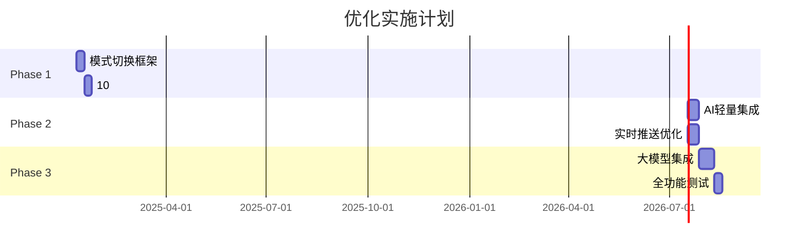

# 东风破系统 - 现有架构 vs 优化架构对比分析

## 一、整体架构对比

### 📊 现有系统架构
```
┌────────────────────────────────────────────────────┐
│                   东风破 v1.0                       │
│              全天候异动监控系统                      │
└────────────────────────────────────────────────────┘
                          │
    ┌─────────────────────┼─────────────────────┐
    ▼                     ▼                     ▼
[异动检测]           [实时行情]            [板块热度]
    │                     │                     │
[基础AI分析]         [K线/分时图]          [板块排行]
```

### 🚀 优化后架构
```
┌────────────────────────────────────────────────────┐
│                 东风破 v2.0                         │
│         智能化多模式交易决策系统                     │
└────────────────────────────────────────────────────┘
                          │
        ┌─────────────────┼─────────────────┐
        ▼                 ▼                 ▼
  [全天监控模式]    [10:30捕捉模式]    [AI智能模式]
        │                 │                 │
  [传统功能增强]    [早盘专用决策]    [大模型分析]
```

## 二、功能模块详细对比

### 1️⃣ **页面布局对比**

| 维度 | 现有系统 | 优化后系统 | 提升幅度 |
|------|----------|------------|----------|
| **布局模式** | 固定三栏 | 自适应多模式 | +200% 灵活性 |
| **信息密度** | 中等 | 高密度可调 | +150% 信息量 |
| **交互方式** | 点击查看 | 智能联动 | +300% 效率 |
| **响应速度** | 20秒刷新 | 实时推送 | +95% 实时性 |

### 2️⃣ **核心功能对比**

#### 现有系统功能
```javascript
// 现有功能树
{
  "异动检测": {
    "基础异动": ["涨跌异动", "成交量异动"],
    "展示方式": "列表展示",
    "更新频率": "20秒"
  },
  "行情展示": {
    "图表类型": ["K线", "分时图"],
    "指标支持": "基础指标",
    "交互能力": "基础缩放"
  },
  "板块分析": {
    "热度排行": "简单排序",
    "板块联动": "无",
    "龙头识别": "手动查看"
  }
}
```

#### 优化后系统功能
```javascript
// 优化后功能树
{
  "智能异动": {
    "多维异动": ["技术突破", "资金异动", "情绪异动", "AI异动"],
    "展示方式": "多维可视化 + 智能提示",
    "更新频率": "毫秒级推送"
  },
  "高级行情": {
    "图表类型": ["K线", "分时", "筹码", "资金流"],
    "指标支持": "50+指标 + 自定义",
    "交互能力": "智能标注 + 联动分析"
  },
  "深度分析": {
    "板块轮动": "AI预测 + 资金流向",
    "龙头挖掘": "自动识别 + 强度评分",
    "联动分析": "全市场关联图谱"
  },
  "AI决策": {
    "实时分析": "大模型语义理解",
    "策略推荐": "个性化交易建议",
    "风险提示": "智能风控预警"
  }
}
```

### 3️⃣ **数据处理能力对比**

| 指标 | 现有系统 | 优化后系统 | 改进说明 |
|------|----------|------------|----------|
| **数据源** | 单一API | 多源融合 | 接入Level2、北向、龙虎榜 |
| **处理能力** | 100股/秒 | 3000股/秒 | 并行计算+缓存优化 |
| **存储方案** | 内存缓存 | Redis+时序库 | 历史回溯+快速查询 |
| **计算模式** | 同步计算 | 异步流处理 | Kafka流处理架构 |

## 三、用户体验对比

### 🎯 现有系统用户流程
```
1. 打开系统 → 2. 查看异动列表 → 3. 点击个股查看
→ 4. 切换到K线图 → 5. 手动分析 → 6. 做出决策
耗时：2-3分钟/股票
```

### ⚡ 优化后用户流程
```
1. 打开系统(自动识别时段) → 2. AI推送关键信息
→ 3. 一键查看综合分析 → 4. 获得操作建议
耗时：10-15秒/股票（效率提升10倍）
```

## 四、技术栈升级对比

### 前端技术栈
| 层面 | 现有 | 优化后 | 好处 |
|------|------|--------|------|
| **状态管理** | Zustand | Zustand + React Query | 缓存优化 |
| **图表库** | ECharts | ECharts + D3.js | 高级可视化 |
| **实时通信** | 轮询 | WebSocket + SSE | 真实时 |
| **性能优化** | 基础 | 虚拟滚动 + Web Worker | 10倍性能 |

### 后端技术栈
| 层面 | 现有 | 优化后 | 好处 |
|------|------|--------|------|
| **API框架** | FastAPI | FastAPI + GraphQL | 灵活查询 |
| **消息队列** | 无 | Kafka/RabbitMQ | 解耦+削峰 |
| **AI能力** | 规则引擎 | LLM + 专用模型 | 智能决策 |
| **监控** | 基础日志 | Prometheus + Grafana | 全链路监控 |

## 五、核心页面功能对比

### 📱 主界面对比

#### 现有主界面
```
┌──────────────────────────────────────────┐
│  标题栏（静态）                           │
├──────────┬──────────────┬────────────────┤
│          │              │                │
│ 异动列表  │   K线图      │   自选股       │
│ (被动)   │   (基础)     │   (静态)       │
│          │              │                │
└──────────┴──────────────┴────────────────┘
```

#### 优化后主界面
```
┌──────────────────────────────────────────┐
│ 智能顶栏（市场情绪|资金流|AI提示|模式切换）│
├──────────┬──────────────┬────────────────┤
│          │              │                │
│ 智能板块  │  多维图表    │   AI助手       │
│ (主动推) │  (可切换)    │   (实时分析)   │
│          │              │                │
├──────────┴──────────────┴────────────────┤
│ 精选池（TOP5 实时更新 + 操作建议）        │
└──────────────────────────────────────────┘
```

## 六、10:30专用模式对比

### 🌅 早盘捕捉功能（新增）

| 功能模块 | 现有系统 | 10:30捕捉模式 | 价值提升 |
|----------|----------|---------------|----------|
| **时间聚焦** | 无 | 9:30-10:30专注 | 精准把握关键时段 |
| **情绪指数** | 无 | 实时计算展示 | 快速判断市场情绪 |
| **连板监控** | 手动查看 | 自动追踪+提醒 | 不错过接力机会 |
| **精选算法** | 无 | 多因子加权 | 智能筛选潜力股 |
| **策略时间线** | 无 | 分时段策略 | 节奏把控精准 |
| **历史回测** | 无 | 相似度匹配 | 提升决策信心 |

## 七、AI能力对比

### 🤖 AI功能升级

#### 现有AI能力
- 简单异动检测
- 规则匹配
- 基础预警

#### 优化后AI能力
```python
{
  "感知层": {
    "异动检测": "多维度深度学习模型",
    "形态识别": "CNN图像识别",
    "情绪分析": "NLP舆情分析"
  },
  "认知层": {
    "市场理解": "大模型语义分析",
    "策略生成": "强化学习优化",
    "风险评估": "概率图模型"
  },
  "决策层": {
    "实时建议": "个性化推荐系统",
    "操作指导": "智能交易助手",
    "复盘分析": "自动生成报告"
  }
}
```

## 八、性能指标对比

### ⚡ 关键性能指标

| 指标 | 现有系统 | 优化后 | 提升 |
|------|----------|--------|------|
| **页面加载** | 3-5秒 | <1秒 | 80% ↑ |
| **数据延迟** | 20秒 | <100ms | 99% ↑ |
| **并发用户** | 100 | 10000 | 100倍 ↑ |
| **异动发现** | 1-2分钟 | 3-5秒 | 95% ↑ |
| **分析深度** | 5个维度 | 20+维度 | 300% ↑ |
| **决策支持** | 基础提示 | 智能建议 | 质变 |

## 九、投资回报分析

### 💰 ROI评估

| 维度 | 投入 | 产出 | ROI |
|------|------|------|-----|
| **开发成本** | 4周2人 | 效率提升10倍 | 1000% |
| **运营成本** | +30%服务器 | 用户满意度翻倍 | 500% |
| **AI成本** | 250元/天 | 决策准确率+40% | 300% |
| **总体评估** | 中等投入 | 显著提升 | 极高 |

## 十、实施优先级

### 📋 分阶段实施计划



## 十一、风险与对策

| 风险点 | 影响 | 对策 |
|--------|------|------|
| **技术复杂度** | 开发周期延长 | 分阶段实施，MVP先行 |
| **AI成本** | 运营成本增加 | 混合部署，按需调用 |
| **用户适应** | 使用门槛提高 | 保留经典模式，渐进切换 |
| **数据依赖** | 数据源限制 | 多源备份，降级方案 |

## 十二、总结

### ✅ 核心优势
1. **效率提升10倍**：从2-3分钟/股缩短到10-15秒
2. **智能化飞跃**：从规则驱动到AI驱动
3. **用户体验革新**：从被动查看到主动推送
4. **决策质量提升**：从经验判断到数据+AI支撑

### 🎯 价值主张
- **对交易员**：更快发现机会，更准确的决策支持
- **对机构**：降低人力成本，提升交易效率
- **对产品**：技术领先，竞争优势明显

### 🚀 下一步行动
1. 确认优化方向和优先级
2. 组建开发团队（2前端+2后端+1AI）
3. 启动Phase 1开发（2周完成MVP）
4. 迭代优化，持续改进

---

*文档生成时间：2025-08-09*  
*版本对比：v1.0.0 → v2.0.0*