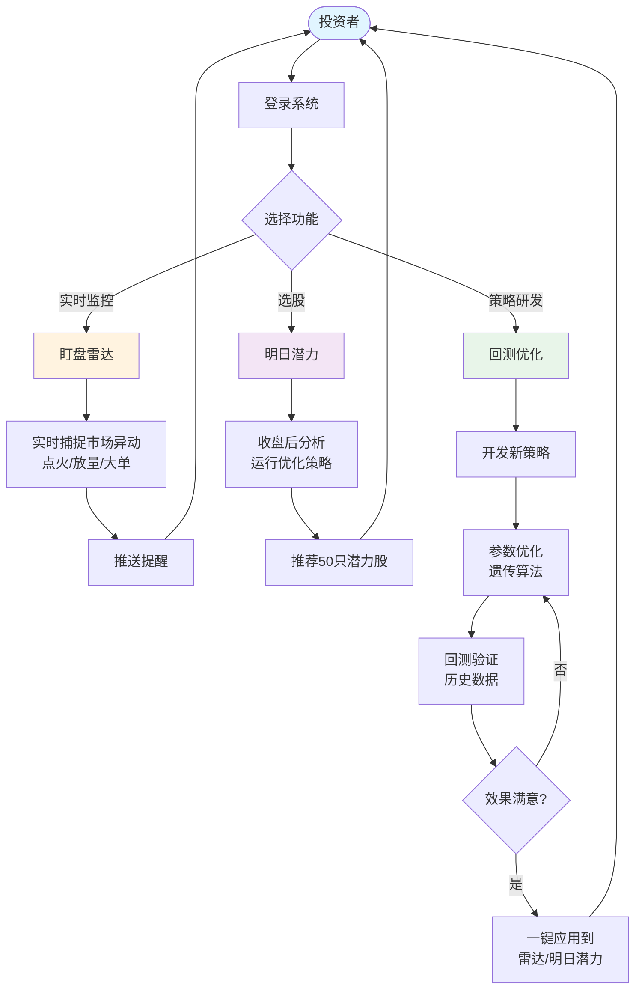
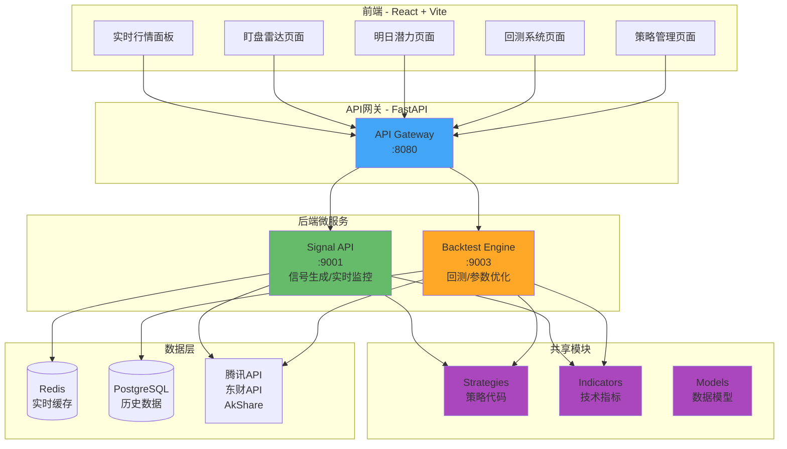

# 东风破量化交易系统 - 产品蓝图

> **愿景**: 打造一个实时、智能、可靠的量化交易辅助平台  
> **核心价值**: 让普通投资者也能享受专业级的策略优化和选股能力

---

## 🎯 最终效果预览

### 用户使用流程



---

## 🏗️ 完整系统架构

### 技术架构图



---

## 💡 核心功能展示

### 1. 盯盘雷达（实时选股）

**场景**: 盘中实时发现异动机会

**效果**:

```
🔴 [10:35] 贵州茅台 (600519) - 点火信号
   涨幅: 3.2%  成交量: 2.4倍  置信度: 85%
   策略: IgnitionStrategy v2.0 (回测年化28.5%)

🟠 [10:38] 宁德时代 (300750) - 放量突破
   涨幅: 2.8%  成交量: 3.1倍  置信度: 78%
   策略: BreakthroughStrategy v1.5 (回测年化24.3%)
```

**技术实现**:

- 每 3 秒扫描全市场
- WebSocket 实时推送
- 使用优化后的策略参数
- 显示策略回测表现

---

### 2. 明日潜力（收盘后选股）

**场景**: 收盘后预测次日潜力股

**效果**:

```
📊 明日潜力Top 10 (2024-01-18收盘后)

排名  代码      名称      置信度  策略数  预测原因
1    600519   贵州茅台   95%    3      多策略共振，突破平台
2    300750   宁德时代   92%    3      放量突破，资金流入
3    000001   平安银行   88%    2      技术形态好转
...
```

**技术实现**:

- 多个优化后的策略投票
- 2 个以上策略看好才推荐
- 按置信度排序
- 提供详细分析依据

---

### 3. 策略回测与优化（核心功能）⭐

**场景**: 开发并优化量化策略

#### 3.1 回测页面

```
┌─────────────────────────────────────────────────┐
│  回测配置                                        │
├─────────────────────────────────────────────────┤
│  策略: [IgnitionStrategy ▼]                     │
│  时间: [2023-01-01] 至 [2024-12-31]             │
│  资金: ¥100,000  手续费: 0.03%  滑点: 0.1%      │
│                                                  │
│  参数优化: [✓] 启用遗传算法                      │
│  - 种群大小: 50                                  │
│  - 迭代代数: 30                                  │
│                                                  │
│  [开始回测] [参数优化] [Walk-Forward分析]        │
└─────────────────────────────────────────────────┘
```

#### 3.2 优化进度

```
🧬 遗传算法优化中...

代数: 18/30
当前最优: 夏普比率 1.82, 年化收益 28.5%

最优参数:
  rise_threshold: 3.2
  volume_ratio: 2.4
  time_window: 5

[进度条████████████░░░░░░░░] 60%
```

#### 3.3 回测结果

```
┌─────────────────────────────────────────────────┐
│  性能指标                                        │
├─────────────────────────────────────────────────┤
│  年化收益率      28.5%  ✅ (目标>15%)            │
│  最大回撤       -12.3%  ✅ (目标<20%)            │
│  夏普比率        1.82   ✅ (目标>1.0)            │
│  胜率           63.2%   ✅ (目标>55%)            │
│  盈亏比          1.82   ✅ (目标>1.5)            │
└─────────────────────────────────────────────────┘

📈 净值曲线图
[ECharts图表：净值从100,000涨到128,500]

📊 回撤曲线图
[ECharts图表：最大回撤-12.3%]

📋 交易明细 (共156笔)
买入    2024-03-15  贵州茅台  ¥1,850  +5.2%
卖出    2024-03-20  宁德时代  ¥245    +3.8%
...
```

#### 3.4 Walk-Forward 验证

```
🔬 Walk-Forward分析结果

期数  训练期收益  测试期收益  性能衰减
 1     32.1%      26.8%      -5.3%
 2     29.5%      24.2%      -5.3%
 3     31.2%      27.5%      -3.7%
 4     28.8%      25.1%      -3.7%

平均   30.4%      25.9%      -4.5%

✅ 性能衰减<10%，策略稳健
```

#### 3.5 一键应用

```
┌─────────────────────────────────────────────────┐
│  策略部署                                        │
├─────────────────────────────────────────────────┤
│  策略名称: IgnitionStrategy v2.0                 │
│  回测表现: 年化28.5%, 夏普1.82                   │
│                                                  │
│  应用范围:                                       │
│  [✓] 盯盘雷达 - 实时捕捉异动                      │
│  [✓] 明日潜力 - 收盘后选股                        │
│                                                  │
│  [确认部署]                                      │
└─────────────────────────────────────────────────┘

✅ 部署成功！策略已应用到生产环境
```

---

### 4. 策略管理

**效果**:

```
📊 策略列表

策略名称              版本  年化收益  夏普  胜率  状态    应用范围
IgnitionStrategy     v2.0   28.5%   1.82  63%   🟢启用  雷达+潜力
BreakthroughStrategy v1.5   24.3%   1.65  58%   🟢启用  雷达+潜力
MomentumStrategy     v1.2   19.8%   1.42  55%   🔴停用  -
TrendFollowStrategy  v0.9   12.3%   0.85  48%   🔴停用  测试中

[添加新策略] [参数优化] [策略对比]
```

---

## 🎬 典型使用场景

### 场景 1: 日常盯盘

```
08:30 - 用户登录系统
09:30 - 开盘，盯盘雷达自动启动
10:35 - 🔔 推送: "贵州茅台急速拉升3.2%"
      - 用户点击查看详情
      - 看到策略回测年化28.5%，胜率63%
      - 决策是否买入
15:00 - 收盘，盯盘雷达自动停止
```

### 场景 2: 研发新策略

```
Day 1: 开发策略
  - 编写新的MomentumStrategy代码
  - 定义参数空间

Day 2: 参数优化
  - 运行遗传算法优化（30代，耗时20分钟）
  - 获得最优参数

Day 2: 回测验证
  - 完整回测2年数据
  - Walk-Forward分析验证稳健性
  - 生成回测报告

Day 3: 上线应用
  - 策略表现达标
  - 一键部署到雷达和明日潜力
  - 开始实时选股
```

### 场景 3: 周末复盘

```
周末 - 用户查看本周选股效果
  - 盯盘雷达本周推荐32只股票
    - 平均涨幅: 4.2%
    - 推荐准确率: 68%

  - 明日潜力本周推荐25只
    - 次日平均涨幅: 2.8%
    - 推荐准确率: 64%

  - 决定是否调整策略参数
```

---

## 📊 预期效果指标

### 系统性能

| 指标       | 目标   | 说明          |
| ---------- | ------ | ------------- |
| 实时延迟   | <100ms | 数据更新延迟  |
| API 响应   | <200ms | P95 响应时间  |
| 系统可用性 | >99.5% | 7x24 小时运行 |
| 并发用户   | >1000  | 同时在线用户  |

### 回测性能

| 指标              | 目标     | 说明       |
| ----------------- | -------- | ---------- |
| 1 年日 K 回测     | <30 秒   | 单策略回测 |
| 遗传算法优化      | <30 分钟 | 50 代优化  |
| Walk-Forward 分析 | <1 小时  | 4 期分析   |

### 选股效果

| 指标           | 目标 | 说明         |
| -------------- | ---- | ------------ |
| 盯盘雷达准确率 | >60% | 当日涨幅>2%  |
| 明日潜力准确率 | >60% | 次日上涨概率 |
| 策略年化收益   | >20% | 回测数据     |
| 最大回撤       | <15% | 风险控制     |

### 用户体验

| 指标       | 目标 | 说明      |
| ---------- | ---- | --------- |
| 日活用户   | >300 | 6 个月后  |
| 用户留存率 | >40% | 30 天留存 |
| NPS        | >50  | 净推荐值  |
| 功能满意度 | >80% | 用户反馈  |

---

## 🚀 核心优势

### vs 同花顺/东方财富

✅ **更智能** - AI 驱动的策略优化，不是简单的技术指标  
✅ **更专业** - 完整的回测和参数优化工具链  
✅ **更精准** - 策略经过历史数据验证，有明确的胜率指标  
✅ **更透明** - 展示策略回测表现，不是"黑盒"推荐

### vs 聚宽/米筐

✅ **更实时** - 专注实时选股，不只是回测工具  
✅ **更简单** - 开箱即用，不需要编程基础  
✅ **更直观** - 现代化 UI，一键部署策略到生产

---

## 💰 商业化展望（可选）

### 免费版

- 基础盯盘雷达（每日 10 条推送）
- 明日潜力 Top 10
- 单策略回测

### 会员版 (¥99/月)

- 无限异动推送
- 明日潜力 Top 50
- 多策略回测
- 参数优化功能
- 策略市场访问

### 专业版 (¥999/年)

- 所有会员功能
- API 接口调用
- 自定义策略开发
- 优先客服

---

## 🎯 最终交付物

### 用户可见

1. ✅ Web 应用 (http://localhost:3000)
2. ✅ 盯盘雷达功能
3. ✅ 明日潜力功能
4. ✅ 回测系统
5. ✅ 策略管理
6. ✅ 手机端适配（响应式）

### 技术交付

1. ✅ 完整源代码
2. ✅ API 文档
3. ✅ 部署文档
4. ✅ 用户手册
5. ✅ 开发文档
6. ✅ 测试报告

---

## 📅 完整时间线

### Phase 1: 框架搭建 (2 周) ← **当前**

- ✅ Shared 模块框架
- ⏳ Backtest Engine 骨架
- ⏳ API 网关路由配置

### Phase 2: 回测引擎 (3 周)

- 回测执行器
- 性能分析器
- 报告生成器

### Phase 3: 参数优化 (3 周)

- 遗传算法实现
- Walk-Forward 分析
- 优化前端页面

### Phase 4: 策略集成 (2 周)

- 策略迁移到 shared/
- 雷达集成优化策略
- 潜力集成优化策略

### Phase 5: 测试优化 (2 周)

- 端到端测试
- 性能优化
- Bug 修复

### Phase 6: 上线部署 (1 周)

- 生产环境部署
- 用户培训
- 文档完善

**总计**: 约 3 个月（12 周）

---

## 🎨 界面预览（概念图）

### 回测页面

```
┌──────────────────────────────────────────────────────────┐
│  东风破 - 回测系统                                   [用户] │
├──────────────────────────────────────────────────────────┤
│                                                            │
│  策略配置 ┃ 回测结果 ┃ 参数优化 ┃ 策略管理                 │
│                                                            │
│  ┌────────────────────┐  ┌──────────────────────────┐   │
│  │  策略选择          │  │  性能指标                  │   │
│  │  ├ IgnitionStrategy│  │  年化收益率    28.5%  ✅  │   │
│  │  ├ Breakthrough    │  │  最大回撤     -12.3%  ✅  │   │
│  │  └ Momentum        │  │  夏普比率      1.82   ✅  │   │
│  │                    │  │  胜率          63.2%  ✅  │   │
│  │  时间范围          │  │                          │   │
│  │  2023-01-01        │  └──────────────────────────┘   │
│  │  至 2024-12-31     │                                  │
│  │                    │  ┌──────────────────────────┐   │
│  │  [开始回测]        │  │  净值曲线                  │   │
│  │  [参数优化]        │  │  ╱                        │   │
│  └────────────────────┘  │ ╱                         │   │
│                           │╱  [ECharts图表]          │   │
│                           └──────────────────────────┘   │
└──────────────────────────────────────────────────────────┘
```

---

**文档维护**: 开发团队  
**最后更新**: 2025-01-18  
**版本**: v1.0
