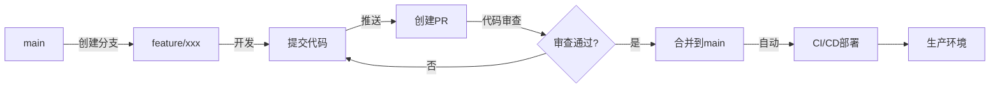
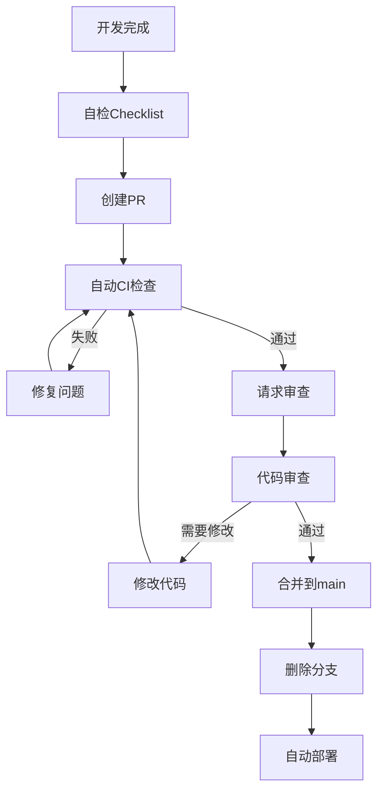

# 东风破开发流程规范

> **版本**: v1.0  
> **更新日期**: 2025-01-18  
> **适用范围**: 东风破全栈团队  
> **目标**: 提升开发效率，保证代码质量，实现快速迭代

---

## 📋 目录

1. [开发方法论](#1-开发方法论)
2. [Git 工作流](#2-git工作流)
3. [分支管理策略](#3-分支管理策略)
4. [代码提交规范](#4-代码提交规范)
5. [代码审查流程](#5-代码审查流程)
6. [测试策略](#6-测试策略)
7. [CI/CD 流程](#7-cicd流程)
8. [发布流程](#8-发布流程)
9. [编码规范](#9-编码规范)
10. [文档规范](#10-文档规范)

---

## 1. 开发方法论

### 1.1 采用 Scrum + Kanban 混合模式

**为什么选择混合模式？**

- ✅ Scrum 的迭代规划适合新功能开发
- ✅ Kanban 的灵活性适合 Bug 修复和紧急需求
- ✅ 小团队更需要灵活性而非严格流程

### 1.2 冲刺周期

**2 周一个 Sprint**

- Week 1-2: 开发 + 测试
- Week 2 末: Sprint 回顾 + 下 Sprint 规划

**每日站会**（可选）

- 时间: 每天早上 10:00，15 分钟
- 内容: 昨天做了什么、今天计划做什么、遇到什么阻碍

### 1.3 需求管理

使用 GitHub Issues + Projects 看板：

**看板列**：

```
待办 → 设计中 → 开发中 → 代码审查 → 测试中 → 已完成
```

**Issue 标签体系**：

- `feature`: 新功能
- `enhancement`: 功能增强
- `bug`: Bug 修复
- `hotfix`: 紧急修复
- `docs`: 文档更新
- `refactor`: 代码重构
- `test`: 测试相关
- `P0/P1/P2/P3`: 优先级

---

## 2. Git 工作流

### 2.1 采用 GitHub Flow（简化版）

**为什么不用 Git Flow？**

- Git Flow 过于复杂，适合大型团队
- 东风破是小团队，需要快速迭代
- GitHub Flow 更简单，更适合持续部署

### 2.2 核心原则

1. **main 分支永远是可部署的**
2. **从 main 创建功能分支**
3. **定期提交，推送到远程**
4. **通过 Pull Request 合并**
5. **代码审查后才能合并**
6. **合并后立即部署**

### 2.3 工作流程图



---

## 3. 分支管理策略

### 3.1 分支命名规范

```
<type>/<ticket-id>-<brief-description>

示例:
feature/DFP-101-backtest-engine
bugfix/DFP-202-radar-crash
hotfix/DFP-303-data-missing
refactor/DFP-404-clean-legacy-code
```

**类型前缀**：

- `feature/`: 新功能
- `bugfix/`: Bug 修复
- `hotfix/`: 紧急修复（可直接从 main 拉取）
- `refactor/`: 代码重构
- `test/`: 测试相关
- `docs/`: 文档更新
- `chore/`: 构建、配置等杂项

### 3.2 分支生命周期

1. **创建分支**

   ```bash
   git checkout main
   git pull origin main
   git checkout -b feature/DFP-101-backtest-engine
   ```

2. **开发过程**

   ```bash
   # 经常提交，保持小粒度
   git add .
   git commit -m "feat: add backtest executor"
   git push origin feature/DFP-101-backtest-engine
   ```

3. **保持与 main 同步**

   ```bash
   git checkout main
   git pull origin main
   git checkout feature/DFP-101-backtest-engine
   git rebase main  # 或使用 merge
   ```

4. **合并后删除**
   ```bash
   # PR合并后
   git checkout main
   git pull origin main
   git branch -d feature/DFP-101-backtest-engine
   git push origin --delete feature/DFP-101-backtest-engine
   ```

### 3.3 分支保护规则

**main 分支保护**：

- ✅ 禁止直接推送
- ✅ 必须通过 PR 合并
- ✅ 至少 1 人审查通过
- ✅ CI 检查必须通过
- ✅ 分支必须是最新的（要求 rebase）

---

## 4. 代码提交规范

### 4.1 Conventional Commits 规范

采用业界标准的[Conventional Commits](https://www.conventionalcommits.org/)：

**格式**：

```
<type>(<scope>): <subject>

<body>

<footer>
```

**示例**：

```
feat(backtest): add genetic algorithm optimizer

- Implement population initialization
- Add fitness evaluation
- Implement crossover and mutation

Closes #101
```

### 4.2 Type 类型

| Type       | 说明                                | 示例                                        |
| ---------- | ----------------------------------- | ------------------------------------------- |
| `feat`     | 新功能                              | `feat(radar): add ignition strategy`        |
| `fix`      | Bug 修复                            | `fix(api): resolve data missing issue`      |
| `docs`     | 文档更新                            | `docs(readme): update installation guide`   |
| `style`    | 代码格式（不影响代码运行）          | `style: format code with black`             |
| `refactor` | 重构（既不是新功能也不是 bug 修复） | `refactor(strategy): extract base class`    |
| `perf`     | 性能优化                            | `perf(backtest): optimize numpy operations` |
| `test`     | 添加测试                            | `test(optimizer): add unit tests`           |
| `chore`    | 构建、配置等                        | `chore(deps): upgrade fastapi to 0.109.0`   |
| `revert`   | 回滚                                | `revert: revert commit abc123`              |

### 4.3 Scope 范围

**后端**：

- `backtest`: 回测引擎
- `optimizer`: 参数优化
- `radar`: 盯盘雷达
- `signal`: 信号服务
- `gateway`: API 网关
- `strategy`: 策略模块

**前端**：

- `ui`: UI 组件
- `page`: 页面
- `chart`: 图表
- `api`: API 调用

**通用**：

- `config`: 配置
- `deps`: 依赖
- `ci`: CI/CD

### 4.4 提交最佳实践

✅ **DO**：

- 每个提交只做一件事
- 提交信息清晰描述改动
- 经常提交，保持小粒度
- 提交前运行测试和 linter

❌ **DON'T**：

- 一个提交包含多个不相关的改动
- 提交信息模糊（如"fix bug"）
- 提交未测试的代码
- 提交包含 TODO 的代码到 main

---

## 5. 代码审查流程

### 5.1 Pull Request 流程



### 5.2 PR 创建规范

**PR 标题**：

```
[<type>] <简短描述>

示例:
[Feature] Add backtest engine with genetic algorithm
[Bugfix] Fix radar crash on empty data
[Hotfix] Resolve data API timeout
```

**PR 描述模板**：

```markdown
## 📝 改动说明

简要说明本次 PR 的目的和改动内容

## 🎯 关联 Issue

Closes #101

## 📋 改动清单

- [ ] 后端
  - [x] 添加回测引擎
  - [x] 实现遗传算法
- [ ] 前端
  - [x] 回测配置页面
  - [x] 结果展示页面
- [ ] 测试
  - [x] 单元测试
  - [ ] 集成测试

## 🧪 测试说明

- 单元测试覆盖率: 85%
- 手动测试步骤:
  1. 启动回测服务
  2. 访问 /backtest 页面
  3. 配置参数并运行

## 📸 截图/录屏

（如果有 UI 改动，附上截图）

## ⚠️ 破坏性变更

无

## 📚 文档

- [x] 更新了 API 文档
- [x] 更新了 README

## ✅ 自检 Checklist

- [x] 代码符合编码规范
- [x] 通过了所有测试
- [x] 添加了必要的测试
- [x] 更新了相关文档
- [x] 没有遗留 TODO
```

### 5.3 代码审查 Checklist

**功能性**：

- [ ] 代码实现了需求的功能
- [ ] 边界条件处理正确
- [ ] 错误处理完善

**代码质量**：

- [ ] 命名清晰（变量、函数、类）
- [ ] 逻辑清晰，易于理解
- [ ] 无重复代码（DRY 原则）
- [ ] 函数单一职责（SRP 原则）
- [ ] 无过长的函数（建议<50 行）

**性能**：

- [ ] 无明显性能问题
- [ ] 数据库查询优化
- [ ] 避免 N+1 查询

**安全**：

- [ ] 输入验证
- [ ] SQL 注入防护
- [ ] XSS 防护
- [ ] 敏感信息加密

**测试**：

- [ ] 核心逻辑有单元测试
- [ ] 测试覆盖率合理（>80%）
- [ ] 测试用例充分

**文档**：

- [ ] 复杂逻辑有注释
- [ ] API 有文档
- [ ] README 更新

### 5.4 审查反馈规范

**使用标签**：

- 🔴 **[必须修改]**: 严重问题，必须修复
- 🟡 **[建议]**: 改进建议，可讨论
- 🟢 **[赞]**: 好的实现，值得学习
- 🔵 **[问题]**: 不理解的地方，需要解释

**示例**：

```
🔴 [必须修改] 这里存在SQL注入风险，需要使用参数化查询

🟡 [建议] 这个函数有点长，建议拆分成几个小函数

🟢 [赞] 这个错误处理写得很好！

🔵 [问题] 为什么这里要用递归而不是循环？
```

---

## 6. 测试策略

### 6.1 测试金字塔

```
        单元测试 (70%)
       /              \
      /   集成测试(20%) \
     /                   \
    /   端到端测试 (10%)   \
   -------------------------
```

### 6.2 单元测试

**原则**：

- 每个函数/方法都应有单元测试
- 测试覆盖率目标：>80%
- 使用 pytest 框架

**示例**：

```python
# tests/test_optimizer.py
import pytest
from backtest.core.optimizer import GeneticOptimizer

def test_genetic_optimizer_initialization():
    """测试遗传算法优化器初始化"""
    optimizer = GeneticOptimizer(
        strategy_class=MockStrategy,
        param_space={'threshold': {'range': [1, 10]}},
        population_size=50
    )
    assert optimizer.population_size == 50
    assert len(optimizer.population) == 50

def test_genetic_optimizer_evolution():
    """测试遗传算法进化过程"""
    optimizer = GeneticOptimizer(...)
    result = optimizer.optimize()

    assert 'best_params' in result
    assert 'best_score' in result
    assert result['best_score'] > 0
```

**命名规范**：

```python
def test_<功能描述>_<场景>_<预期结果>():
    # 例如:
    # test_backtest_with_empty_data_raises_error
    # test_optimizer_finds_best_params_successfully
    pass
```

### 6.3 集成测试

**测试服务之间的交互**：

```python
# tests/integration/test_backtest_flow.py
@pytest.mark.integration
async def test_complete_backtest_flow():
    """测试完整回测流程：配置→执行→结果"""
    # 1. 创建回测任务
    response = await client.post('/api/backtest/run', json={
        'strategy': 'ignition',
        'params': {...}
    })
    task_id = response.json()['task_id']

    # 2. 等待执行完成
    await wait_for_completion(task_id)

    # 3. 获取结果
    result = await client.get(f'/api/backtest/results/{task_id}')
    assert result.status_code == 200
    assert result.json()['metrics']['total_return'] > 0
```

### 6.4 端到端测试

使用 Playwright 进行前端 E2E 测试：

```python
# tests/e2e/test_backtest_page.py
def test_backtest_page_workflow(page):
    """测试回测页面完整流程"""
    # 访问页面
    page.goto('http://localhost:3000/backtest')

    # 选择策略
    page.select_option('#strategy', 'ignition')

    # 配置参数
    page.fill('#start-date', '2023-01-01')
    page.fill('#end-date', '2024-12-31')

    # 运行回测
    page.click('button:text("开始回测")')

    # 等待结果
    page.wait_for_selector('.backtest-result')

    # 验证结果
    assert page.is_visible('.performance-chart')
```

### 6.5 测试运行

```bash
# 运行所有测试
pytest

# 运行单元测试
pytest tests/unit

# 运行集成测试
pytest tests/integration -m integration

# 生成覆盖率报告
pytest --cov=backtest_engine --cov-report=html
```

---

## 7. CI/CD 流程

### 7.1 CI 流程（GitHub Actions）

**`.github/workflows/ci.yml`**:

```yaml
name: CI

on:
  push:
    branches: [main]
  pull_request:
    branches: [main]

jobs:
  test-backend:
    runs-on: ubuntu-latest
    steps:
      - uses: actions/checkout@v3

      - name: Set up Python
        uses: actions/setup-python@v4
        with:
          python-version: "3.12"

      - name: Install dependencies
        run: |
          pip install -r requirements.txt
          pip install -r requirements-dev.txt

      - name: Lint with ruff
        run: ruff check .

      - name: Type check with mypy
        run: mypy services/

      - name: Run tests
        run: pytest --cov --cov-report=xml

      - name: Upload coverage
        uses: codecov/codecov-action@v3

  test-frontend:
    runs-on: ubuntu-latest
    steps:
      - uses: actions/checkout@v3

      - name: Set up Node.js
        uses: actions/setup-node@v3
        with:
          node-version: "18"

      - name: Install dependencies
        run: cd frontend && npm ci

      - name: Lint
        run: cd frontend && npm run lint

      - name: Type check
        run: cd frontend && npm run type-check

      - name: Run tests
        run: cd frontend && npm test

      - name: Build
        run: cd frontend && npm run build
```

### 7.2 CD 流程

**自动部署流程**：

```yaml
name: CD

on:
  push:
    branches: [main]

jobs:
  deploy:
    runs-on: ubuntu-latest
    if: github.event_name == 'push'
    steps:
      - uses: actions/checkout@v3

      - name: Deploy to production
        run: |
          # 部署脚本
          ./scripts/deploy.sh
```

---

## 8. 发布流程

### 8.1 语义化版本

采用[SemVer](https://semver.org/)规范：`MAJOR.MINOR.PATCH`

- **MAJOR**: 不兼容的 API 变更
- **MINOR**: 向后兼容的功能新增
- **PATCH**: 向后兼容的 Bug 修复

**示例**：

```
v1.0.0 → 初始版本
v1.1.0 → 添加回测功能
v1.1.1 → 修复回测Bug
v2.0.0 → 重构API（破坏性变更）
```

### 8.2 发布 Checklist

- [ ] 所有测试通过
- [ ] 代码审查完成
- [ ] 更新 CHANGELOG.md
- [ ] 更新版本号
- [ ] 创建 Git tag
- [ ] 部署到生产环境
- [ ] 发布说明

### 8.3 CHANGELOG 格式

```markdown
# Changelog

## [1.1.0] - 2025-01-18

### Added

- 回测引擎功能
- 遗传算法参数优化
- Walk-Forward 分析

### Changed

- 优化雷达扫描性能

### Fixed

- 修复数据缺失问题

### Deprecated

- 旧版 API 将在 v2.0 移除
```

---

## 9. 编码规范

### 9.1 Python（PEP 8 + Black）

**使用工具**：

- **Black**: 代码格式化
- **Ruff**: 快速 linter
- **Mypy**: 类型检查

**配置文件 `pyproject.toml`**：

```toml
[tool.black]
line-length = 100
target-version = ['py312']

[tool.ruff]
line-length = 100
select = ["E", "F", "I", "N", "W"]

[tool.mypy]
python_version = "3.12"
strict = true
```

**命名规范**：

```python
# 模块/包: 小写+下划线
backtest_engine/

# 类: 大驼峰
class GeneticOptimizer:

# 函数/方法: 小写+下划线
def calculate_fitness():

# 常量: 大写+下划线
MAX_POPULATION_SIZE = 100

# 私有: 前缀单下划线
def _internal_method():
```

### 9.2 TypeScript/React

**使用工具**：

- **ESLint**: 代码检查
- **Prettier**: 代码格式化
- **TypeScript**: 类型检查

**命名规范**：

```typescript
// 组件: 大驼峰
const BacktestPage: React.FC = () => {};

// 函数: 小驼峰
function calculatePerformance() {}

// 接口/类型: 大驼峰，加I前缀
interface IBacktestResult {}

// 常量: 大写+下划线
const API_BASE_URL = "...";

// 文件名:
// 组件: BacktestPage.tsx
// 工具: utils.ts
// 类型: types.ts
```

---

## 10. 文档规范

### 10.1 代码注释

**Python 文档字符串**：

```python
def calculate_sharpe_ratio(returns: pd.Series, risk_free_rate: float = 0.03) -> float:
    """
    计算夏普比率

    Args:
        returns: 收益率序列
        risk_free_rate: 无风险利率，默认3%

    Returns:
        夏普比率值

    Raises:
        ValueError: 如果收益率序列为空

    Examples:
        >>> returns = pd.Series([0.01, 0.02, -0.01])
        >>> calculate_sharpe_ratio(returns)
        1.23
    """
    if len(returns) == 0:
        raise ValueError("收益率序列不能为空")

    excess_returns = returns - risk_free_rate / 252
    return excess_returns.mean() / excess_returns.std() * np.sqrt(252)
```

### 10.2 README 结构

```markdown
# 项目名称

简短描述

## 功能特性

- 特性 1
- 特性 2

## 快速开始

### 环境要求

### 安装

### 运行

## 架构设计

## API 文档

## 开发指南

## 测试

## 部署

## 贡献指南

## 许可证
```

---

## 📊 流程执行检查清单

### 开发前

- [ ] 在 GitHub Issues 创建 Issue
- [ ] Issue 分配到当前 Sprint
- [ ] 从 main 创建功能分支

### 开发中

- [ ] 遵循编码规范
- [ ] 经常提交，保持小粒度
- [ ] 编写单元测试
- [ ] 本地运行测试和 linter

### 提交 PR 前

- [ ] 代码格式化（Black/Prettier）
- [ ] Linter 检查通过
- [ ] 所有测试通过
- [ ] 测试覆盖率>80%
- [ ] 更新文档
- [ ] 填写完整的 PR 描述

### 代码审查

- [ ] 至少 1 人审查通过
- [ ] CI 检查全部通过
- [ ] 解决所有审查意见

### 合并后

- [ ] 删除功能分支
- [ ] 关闭相关 Issue
- [ ] 验证生产环境部署

---

**文档维护者**: 开发团队  
**最后更新**: 2025-01-18  
**下次审核**: 每季度或有重大变更时
