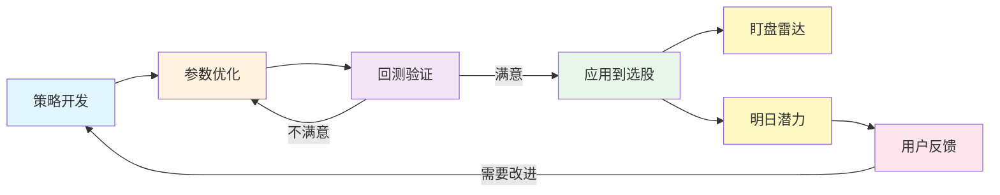

# 东风破量化策略开发闭环设计方案

> **版本**: v1.0  
> **日期**: 2025-01-18  
> **状态**: 设计完成，待实施

---

## 📋 目录

1. [闭环流程概览](#1-闭环流程概览)
2. [策略开发](#2-策略开发)
3. [参数优化](#3-参数优化)
4. [回测验证](#4-回测验证)
5. [应用到选股](#5-应用到选股)
6. [技术架构](#6-技术架构)
7. [实施计划](#7-实施计划)

---

## 1. 闭环流程概览

### 1.1 完整流程图



### 1.2 设计理念

> **专注智能选股，不做实盘交易**

通过历史数据优化策略参数，将经过验证的策略应用到"盯盘雷达"和"明日潜力"功能，为用户提供高质量的股票筛选结果。

### 1.3 核心价值

✅ **数据驱动** - 基于历史数据优化，而非主观判断  
✅ **持续迭代** - 参数优化和回测验证可反复进行  
✅ **防止过拟合** - Walk-Forward 分析确保策略稳健性  
✅ **快速应用** - 验证通过的策略立即应用到生产环境

---

## 2. 策略开发

### 2.1 策略类型

#### 盯盘雷达策略（实时）

- **点火策略**：捕捉急速拉升
- **放量突破策略**：成交量异动
- **资金流入策略**：大单买入

#### 明日潜力策略（每日）

- **突破策略**：技术形态突破
- **动量策略**：价格动量持续
- **均线策略**：多均线共振

### 2.2 策略框架设计

```python
# shared/strategies/base.py
from abc import ABC, abstractmethod
from typing import Dict, Any, Optional

class BaseStrategy(ABC):
    """策略基类"""

    # 参数定义（供优化使用）
    params = {
        'param1': {
            'type': 'float',
            'range': [1.0, 10.0],
            'default': 5.0,
            'description': '参数说明'
        }
    }

    def __init__(self, **kwargs):
        """初始化策略参数"""
        # 设置默认值
        for key, value in self.params.items():
            setattr(self, key, value['default'])

        # 覆盖用户提供的参数
        for key, value in kwargs.items():
            if key in self.params:
                setattr(self, key, value)

    @abstractmethod
    def generate_signal(self, data: Dict[str, Any]) -> Optional[Dict]:
        """
        生成交易信号

        Args:
            data: 股票数据字典

        Returns:
            信号字典，包含action, confidence, reason等字段
            如果不产生信号则返回None
        """
        pass

    def get_param_space(self) -> Dict:
        """获取参数空间（供优化器使用）"""
        return self.params

    def validate_params(self) -> bool:
        """验证参数合法性"""
        for key, config in self.params.items():
            value = getattr(self, key)
            min_val, max_val = config['range']
            if not (min_val <= value <= max_val):
                return False
        return True
```

### 2.3 示例策略

```python
# shared/strategies/ignition.py
class IgnitionStrategy(BaseStrategy):
    """点火策略 - 捕捉急速拉升"""

    params = {
        'rise_threshold': {
            'type': 'float',
            'range': [2.0, 5.0],
            'default': 3.0,
            'description': '涨幅阈值(%)'
        },
        'volume_ratio': {
            'type': 'float',
            'range': [1.5, 3.0],
            'default': 2.0,
            'description': '成交量倍数'
        },
        'time_window': {
            'type': 'int',
            'range': [3, 10],
            'default': 5,
            'description': '时间窗口(分钟)'
        },
        'min_price': {
            'type': 'float',
            'range': [5.0, 50.0],
            'default': 10.0,
            'description': '最低价格'
        }
    }

    def generate_signal(self, data: Dict[str, Any]) -> Optional[Dict]:
        """检测急速拉升信号"""
        # 价格过滤
        if data['current_price'] < self.min_price:
            return None

        # 计算涨幅
        rise = (data['current_price'] - data['open']) / data['open'] * 100

        # 计算成交量比
        vol_ratio = data['volume'] / data['avg_volume_5d']

        # 判断信号
        if rise >= self.rise_threshold and vol_ratio >= self.volume_ratio:
            confidence = min(rise / 10 * 100, 100)  # 涨幅越大信心越足

            return {
                'action': 'BUY',
                'confidence': confidence,
                'reason': f'急速拉升{rise:.2f}%，成交量{vol_ratio:.2f}倍',
                'detail': {
                    'rise': rise,
                    'volume_ratio': vol_ratio,
                    'price': data['current_price']
                }
            }

        return None
```

---

## 3. 参数优化

### 3.1 优化算法对比

| 算法       | 适用场景   | 优点       | 缺点         | 推荐度     |
| ---------- | ---------- | ---------- | ------------ | ---------- |
| 网格搜索   | 参数 ≤3 个 | 详尽、可靠 | 慢           | ⭐⭐⭐     |
| 随机搜索   | 参数>3 个  | 快速       | 可能遗漏最优 | ⭐⭐⭐⭐   |
| 遗传算法   | 复杂策略   | 智能、高效 | 需要调参     | ⭐⭐⭐⭐⭐ |
| 贝叶斯优化 | 高级应用   | 样本高效   | 实现复杂     | ⭐⭐⭐     |

### 3.2 遗传算法实现（推荐）

```python
# services/backtest-engine/core/optimizer.py
import numpy as np
from typing import Dict, List, Callable

class GeneticOptimizer:
    """遗传算法参数优化器"""

    def __init__(
        self,
        strategy_class,
        param_space: Dict,
        objective_fn: Callable,
        population_size: int = 50,
        generations: int = 30,
        mutation_rate: float = 0.1,
        crossover_rate: float = 0.8
    ):
        self.strategy_class = strategy_class
        self.param_space = param_space
        self.objective_fn = objective_fn
        self.population_size = population_size
        self.generations = generations
        self.mutation_rate = mutation_rate
        self.crossover_rate = crossover_rate

    def optimize(self) -> Dict:
        """执行优化"""
        # 初始化种群
        population = self._init_population()

        best_history = []

        for gen in range(self.generations):
            # 评估适应度
            fitness_scores = self._evaluate_population(population)

            # 记录最优个体
            best_idx = np.argmax(fitness_scores)
            best_params = population[best_idx]
            best_score = fitness_scores[best_idx]

            best_history.append({
                'generation': gen,
                'params': best_params.copy(),
                'score': best_score
            })

            print(f"Generation {gen+1}/{self.generations}: "
                  f"Best Score = {best_score:.4f}")

            # 选择
            selected = self._selection(population, fitness_scores)

            # 交叉
            offspring = self._crossover(selected)

            # 变异
            offspring = self._mutation(offspring)

            # 更新种群
            population = offspring

        return {
            'best_params': best_history[-1]['params'],
            'best_score': best_history[-1]['score'],
            'history': best_history
        }

    def _init_population(self) -> List[Dict]:
        """初始化种群"""
        population = []
        for _ in range(self.population_size):
            individual = {}
            for param_name, param_config in self.param_space.items():
                min_val, max_val = param_config['range']
                param_type = param_config['type']

                if param_type == 'float':
                    individual[param_name] = np.random.uniform(min_val, max_val)
                elif param_type == 'int':
                    individual[param_name] = np.random.randint(min_val, max_val + 1)

            population.append(individual)

        return population

    def _evaluate_population(self, population: List[Dict]) -> np.ndarray:
        """评估种群适应度"""
        scores = []
        for params in population:
            score = self.objective_fn(params)
            scores.append(score)
        return np.array(scores)

    def _selection(self, population: List[Dict], fitness: np.ndarray) -> List[Dict]:
        """轮盘赌选择"""
        # 归一化适应度
        fitness = fitness - fitness.min() + 1e-6
        probabilities = fitness / fitness.sum()

        # 选择
        selected_indices = np.random.choice(
            len(population),
            size=self.population_size,
            p=probabilities,
            replace=True
        )

        return [population[i].copy() for i in selected_indices]

    def _crossover(self, population: List[Dict]) -> List[Dict]:
        """单点交叉"""
        offspring = []
        for i in range(0, len(population), 2):
            parent1 = population[i]
            parent2 = population[i + 1] if i + 1 < len(population) else population[0]

            if np.random.rand() < self.crossover_rate:
                # 交叉
                child1, child2 = {}, {}
                params = list(parent1.keys())
                crossover_point = np.random.randint(1, len(params))

                for j, param in enumerate(params):
                    if j < crossover_point:
                        child1[param] = parent1[param]
                        child2[param] = parent2[param]
                    else:
                        child1[param] = parent2[param]
                        child2[param] = parent1[param]

                offspring.extend([child1, child2])
            else:
                offspring.extend([parent1.copy(), parent2.copy()])

        return offspring[:self.population_size]

    def _mutation(self, population: List[Dict]) -> List[Dict]:
        """变异"""
        for individual in population:
            if np.random.rand() < self.mutation_rate:
                # 随机选择一个参数变异
                param_name = np.random.choice(list(individual.keys()))
                param_config = self.param_space[param_name]
                min_val, max_val = param_config['range']
                param_type = param_config['type']

                if param_type == 'float':
                    individual[param_name] = np.random.uniform(min_val, max_val)
                elif param_type == 'int':
                    individual[param_name] = np.random.randint(min_val, max_val + 1)

        return population
```

### 3.3 Walk-Forward 分析（防过拟合）

```python
def walk_forward_analysis(
    strategy_class,
    data,
    param_space,
    train_months=12,
    test_months=3
):
    """
    滚动窗口分析

    Args:
        strategy_class: 策略类
        data: 完整历史数据
        param_space: 参数空间
        train_months: 训练期长度（月）
        test_months: 测试期长度（月）
    """
    train_days = train_months * 21
    test_days = test_months * 21

    results = []

    for start in range(0, len(data) - train_days - test_days, test_days):
        # 训练期
        train_data = data[start:start + train_days]

        # 优化参数
        optimizer = GeneticOptimizer(strategy_class, param_space, ...)
        best_params = optimizer.optimize()['best_params']

        # 测试期
        test_data = data[start + train_days:start + train_days + test_days]

        # 在测试期验证
        test_result = backtest(strategy_class, test_data, best_params)

        results.append({
            'period': f'{start}-{start + train_days + test_days}',
            'params': best_params,
            'test_metrics': test_result.metrics
        })

    return results
```

---

## 4. 回测验证

### 4.1 验证指标

**必须达标**：

- ✅ 年化收益率 > 15%
- ✅ 最大回撤 < 20%
- ✅ 夏普比率 > 1.0
- ✅ 胜率 > 55%

**参考指标**：

- 盈亏比 > 1.5
- 索提诺比率 > 1.0
- 卡玛比率 > 0.5

### 4.2 回测报告模板

````markdown
# 回测报告 - 点火策略 v2.0

## 基本信息

- 策略: IgnitionStrategy
- 版本: 2.0
- 优化方法: 遗传算法(50 代)
- 回测期: 2023-01-01 ~ 2024-12-31
- 初始资金: ¥100,000

## 性能指标

| 指标       | 数值   | 目标 | 状态 |
| ---------- | ------ | ---- | ---- |
| 年化收益率 | 28.5%  | >15% | ✅   |
| 最大回撤   | -12.3% | <20% | ✅   |
| 夏普比率   | 1.68   | >1.0 | ✅   |
| 胜率       | 63.2%  | >55% | ✅   |

## 最优参数

```python
{
    'rise_threshold': 3.2,
    'volume_ratio': 2.4,
    'time_window': 5,
    'min_price': 12.0
}
```
````

## Walk-Forward 分析

样本外性能衰减: 4.5% (可接受)

## 结论

✅ 策略通过验证，建议上线

````

---

## 5. 应用到选股

### 5.1 集成到盯盘雷达

```python
# services/signal-api/core/quant/engines/radar.py
from shared.strategies.ignition import IgnitionStrategy

class RadarEngine:
    def __init__(self):
        # 使用优化后的参数
        self.strategies = {
            'ignition': IgnitionStrategy(
                rise_threshold=3.2,
                volume_ratio=2.4,
                time_window=5,
                min_price=12.0
            )
        }

    async def scan_market(self):
        """扫描市场异动"""
        stocks = await self.get_active_stocks()
        signals = []

        for stock in stocks:
            data = await self.get_realtime_data(stock['code'])

            # 应用策略
            for strategy_name, strategy in self.strategies.items():
                signal = strategy.generate_signal(data)
                if signal:
                    signals.append({
                        'code': stock['code'],
                        'name': stock['name'],
                        'strategy': strategy_name,
                        'signal': signal
                    })

        return signals
````

### 5.2 集成到明日潜力

```python
# services/signal-api/core/quant/engines/tomorrow.py
class TomorrowPredictor:
    def __init__(self):
        # 多策略组合
        self.strategies = [
            TomorrowPotentialStrategy(...),
            BreakthroughStrategy(...),
            MomentumStrategy(...)
        ]

    async def predict(self):
        """预测明日潜力股"""
        stocks = await self.get_all_stocks()
        predictions = []

        for stock in stocks:
            data = await self.get_daily_data(stock['code'])

            # 多策略投票
            votes = []
            for strategy in self.strategies:
                signal = strategy.generate_signal(data)
                if signal:
                    votes.append(signal)

            # 2个以上策略看好才推荐
            if len(votes) >= 2:
                predictions.append({
                    'code': stock['code'],
                    'name': stock['name'],
                    'confidence': len(votes) * 30,
                    'strategies': [s.__class__.__name__ for s in self.strategies]
                })

        return sorted(predictions, key=lambda x: x['confidence'], reverse=True)[:50]
```

---

## 6. 技术架构

### 6.1 项目结构

```
东风破/
├── services/
│   ├── backtest-engine/          # 回测优化服务
│   │   ├── core/
│   │   │   ├── executor.py       # 回测执行器
│   │   │   ├── optimizer.py      # 参数优化器
│   │   │   ├── analyzer.py       # 性能分析
│   │   │   └── reporter.py       # 报告生成
│   │   └── routers/
│   │       ├── backtest.py
│   │       └── optimize.py
│   │
│   ├── signal-api/
│   │   └── core/quant/engines/
│   │       ├── radar.py          # 盯盘雷达
│   │       └── tomorrow.py       # 明日潜力
│   │
├── shared/                       # 共享模块
│   ├── strategies/               # 策略库
│   │   ├── base.py
│   │   ├── ignition.py
│   │   └── tomorrow_potential.py
│   ├── indicators/
│   └── models/
│
└── frontend/
    └── src/pages/
        ├── Backtest/
        ├── Optimization/
        └── StrategyManagement/
```

### 6.2 API 设计

```
POST /api/optimize/run           # 运行参数优化
GET  /api/optimize/tasks/{id}    # 查询优化状态
GET  /api/optimize/results/{id}  # 获取优化结果

POST /api/backtest/run           # 运行回测
GET  /api/backtest/results/{id}  # 获取回测结果

POST /api/strategy/deploy        # 部署策略到生产
GET  /api/strategy/list          # 获取策略列表
```

---

## 7. 实施计划

### Phase 1: 回测基础（2 周）

- [x] 回测引擎开发
- [ ] 基本指标计算
- [ ] 前端回测页面

### Phase 2: 参数优化（2 周）⬅️ 当前重点

- [ ] 网格搜索
- [ ] 遗传算法
- [ ] Walk-Forward 分析
- [ ] 前端优化页面

### Phase 3: 策略集成（1 周）

- [ ] 策略迁移到 shared/
- [ ] 盯盘雷达集成
- [ ] 明日潜力集成

### Phase 4: 持续迭代

- [ ] 收集反馈
- [ ] 优化策略
- [ ] 开发新策略

---

**文档版本**: v1.0  
**创建日期**: 2025-01-18  
**维护者**: 开发团队
