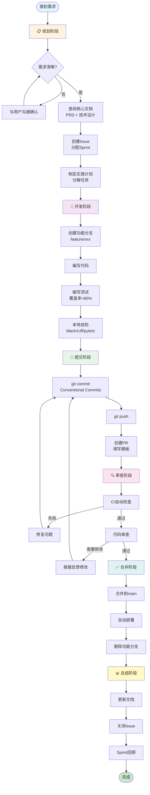
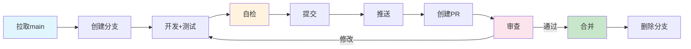
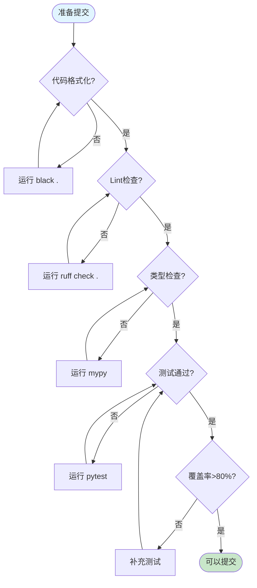
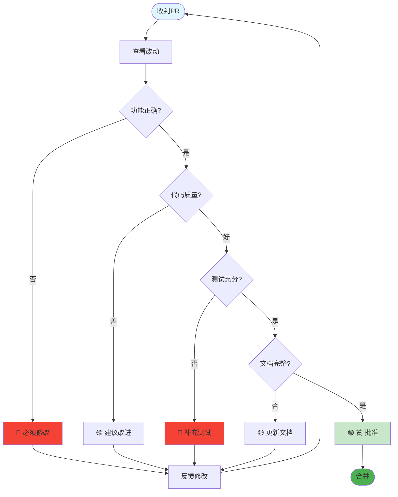

# 阶段性工作流程

> **用途**: 日常开发工作的标准流程  
> **特点**: 简洁、规范、可执行  
> **更新**: 2025-01-18

---

## 📊 完整开发流程



---

## ⚡ 日常开发快速流程



### 快速命令

```bash
# 1. 拉取main
git checkout main && git pull

# 2. 创建分支
git checkout -b feature/DFP-101-xxx

# 3. 开发+测试
# ... 编写代码 ...
pytest

# 4. 自检
black . && ruff check . && pytest --cov

# 5-6. 提交+推送
git add .
git commit -m "feat(scope): description"
git push origin feature/DFP-101-xxx

# 7. 创建PR (在GitHub上)

# 8. 审查通过后
git checkout main && git pull
git branch -d feature/DFP-101-xxx
```

---

## ✅ 自检清单（提交前必做）



### 自检命令

```bash
# 一键自检
black . && ruff check . && mypy services/ && pytest --cov

# 或分步执行
black .                    # 1. 格式化
ruff check .               # 2. Lint检查
mypy services/             # 3. 类型检查
pytest --cov               # 4. 测试+覆盖率
```

---

## 🔍 PR 审查流程



### 审查标签

使用标签给出反馈：

- 🔴 **[必须修改]**: 严重问题，必须修复才能合并
- 🟡 **[建议]**: 改进建议，可以讨论
- 🟢 **[赞]**: 好的实现，值得学习
- 🔵 **[问题]**: 不理解的地方，需要解释

---

## 📋 各阶段详细说明

### 1️⃣ 规划阶段

**目标**: 明确需求，制定计划

**步骤**:

1. 查阅 [PRD](./analysis/PRD-东风破-股票量化交易系统.md) 确认功能需求
2. 查阅 [技术设计文档](./量化策略开发闭环设计.md) 了解架构
3. 在 GitHub 创建 Issue，描述清楚要做什么
4. 分配到当前 Sprint
5. 分解任务（如果是大功能）

**产出**:

- ✅ Issue 已创建
- ✅ 任务已分解
- ✅ 工作量评估完成

---

### 2️⃣ 开发阶段

**目标**: 高质量完成功能开发

**步骤**:

1. 创建功能分支: `git checkout -b feature/DFP-101-xxx`
2. 编写代码（遵循编码规范）
3. 编写单元测试（覆盖率>80%）
4. 本地自检（运行所有检查）

**检查点**:

- ✅ 代码符合编码规范
- ✅ 测试覆盖率>=80%
- ✅ 所有测试通过
- ✅ 没有 TODO/FIXME

**工具**:

```bash
black .                  # 格式化
ruff check .             # Lint
mypy services/           # 类型检查
pytest --cov            # 测试
```

---

### 3️⃣ 提交阶段

**目标**: 规范提交代码

**步骤**:

1. `git add .`
2. `git commit -m "type(scope): subject"`
3. `git push origin feature/DFP-101-xxx`
4. 在 GitHub 创建 PR，填写模板

**提交信息格式**:

```
feat(backtest): add genetic algorithm optimizer

- Implement population initialization
- Add crossover and mutation
- Add fitness evaluation

Closes #101
```

**PR 标题格式**:

```
[Feature] Add genetic algorithm optimizer
[Bugfix] Fix radar crash on empty data
[Hotfix] Resolve critical API timeout
```

---

### 4️⃣ 审查阶段

**目标**: 保证代码质量

**步骤**:

1. CI 自动检查（Lint、Test、Build）
2. 至少 1 人代码审查
3. 根据反馈修改
4. 再次审查直到通过

**审查要点**:

- ✅ 功能实现正确
- ✅ 代码质量良好
- ✅ 测试充分
- ✅ 文档完整
- ✅ 无安全问题

**审查者职责**:

- 仔细阅读改动
- 给出建设性反馈
- 使用标签（🔴🟡🟢🔵）
- 24 小时内完成审查

---

### 5️⃣ 合并阶段

**目标**: 安全合并到 main

**步骤**:

1. 确认 CI 全绿
2. 确认审查通过
3. 点击"Squash and merge"或"Merge"
4. 自动部署到生产环境
5. 删除功能分支

**合并条件**:

- ✅ CI 检查全部通过
- ✅ 至少 1 人审查通过
- ✅ 分支是最新的（已 rebase main）
- ✅ 无未解决的审查意见

---

### 6️⃣ 总结阶段

**目标**: 沉淀经验，持续改进

**步骤**:

1. 更新相关文档（如果有架构变更）
2. 关闭相关 Issue
3. Sprint 回顾（每 2 周一次）

**Sprint 回顾内容**:

- 本 Sprint 完成了什么？
- 遇到了什么问题？
- 有什么可以改进的？
- 下 Sprint 计划做什么？

---

## ⏱️ 时间参考

| 阶段     | 小功能   | 中功能     | 大功能   |
| -------- | -------- | ---------- | -------- |
| 规划     | 30 分钟  | 2 小时     | 1 天     |
| 开发     | 2-4 小时 | 1-2 天     | 3-5 天   |
| 提交     | 15 分钟  | 15 分钟    | 30 分钟  |
| 审查     | 30 分钟  | 1 小时     | 2 小时   |
| 合并     | 5 分钟   | 5 分钟     | 10 分钟  |
| 总结     | 15 分钟  | 30 分钟    | 1 小时   |
| **总计** | **半天** | **2-3 天** | **1 周** |

---

## 🚨 常见问题

### Q: 紧急 Bug 怎么处理？

创建 hotfix 分支，快速通道：

```bash
git checkout main
git pull
git checkout -b hotfix/DFP-999-critical-bug

# 快速修复+测试
git add .
git commit -m "fix: resolve critical bug"
git push origin hotfix/DFP-999-critical-bug

# 创建PR，标记为Hotfix
# 简化审查，立即合并
```

### Q: 审查意见有争议怎么办？

1. 先理解对方观点
2. 在 PR 评论中讨论
3. 如果无法达成一致，找 Tech Lead 决策
4. 记录决策原因

### Q: CI 一直失败怎么办？

1. 查看 CI 日志，定位问题
2. 本地复现并修复
3. 重新提交
4. 如果是 CI 配置问题，联系 DevOps

### Q: 没人审查 PR 怎么办？

1. 在 PR 中@具体的人
2. 在团队群里提醒
3. 如果超过 24 小时，找 Tech Lead
4. 考虑是否 PR 太大，需要拆分

---

## 📝 检查清单总结

### 开发前

- [ ] 查阅 PRD 和技术设计
- [ ] 创建 Issue
- [ ] 创建功能分支

### 开发中

- [ ] 遵循编码规范
- [ ] 编写单元测试
- [ ] 经常提交

### 提交前

- [ ] `black .` 格式化
- [ ] `ruff check .` Lint 检查
- [ ] `mypy` 类型检查
- [ ] `pytest --cov` 测试通过，覆盖率>80%
- [ ] 填写完整的 PR 描述

### 审查时

- [ ] 功能正确
- [ ] 代码质量好
- [ ] 测试充分
- [ ] 文档完整

### 合并后

- [ ] 删除功能分支
- [ ] 关闭 Issue
- [ ] 验证生产环境

---

**维护者**: 开发团队  
**最后更新**: 2025-01-18  
**关联文档**: [开发流程规范](./开发流程规范.md) | [Git 工作流](./GIT_WORKFLOW.md)
