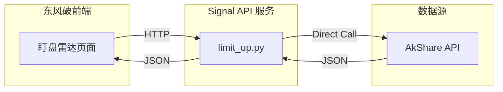
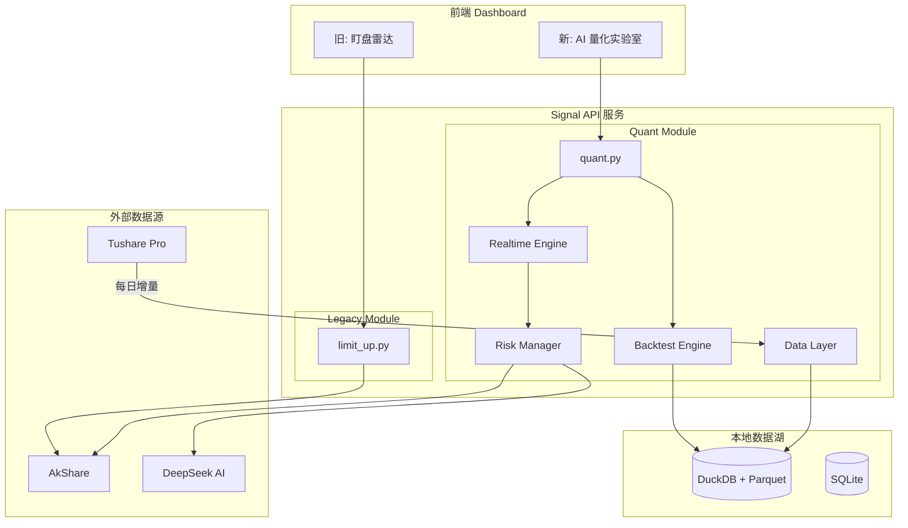
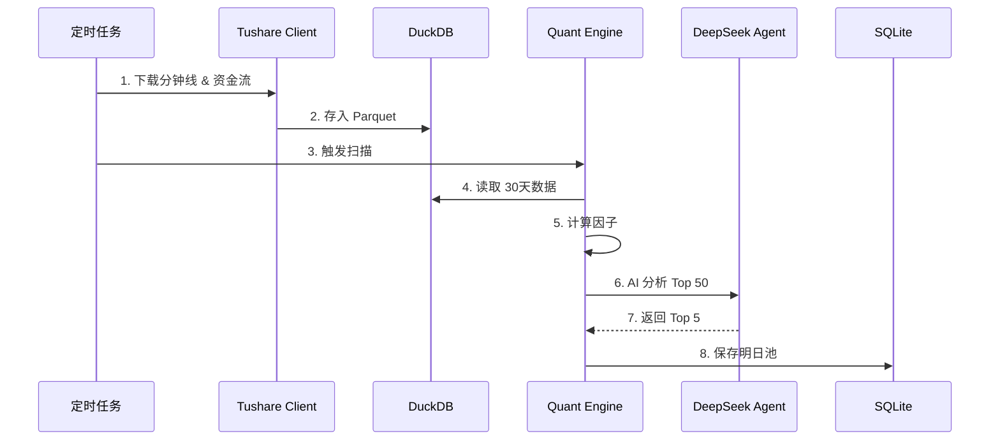
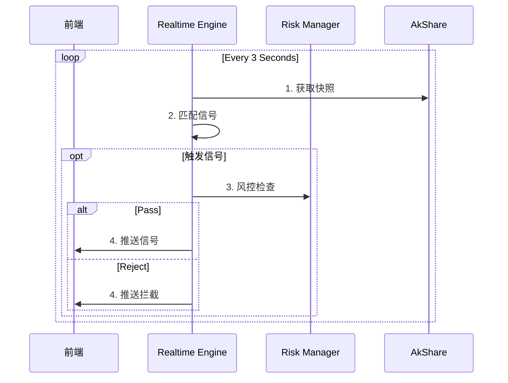

# 架构方案：AI量化分析平台 - v20 完整版

## 1. 架构演进对比 (Architecture Evolution)

### 1.1 现有架构 (Current / Legacy)
目前的架构是简单的"直连查询"模式，无状态、无风控、无回测。

### 1.2 集成后架构 (Integrated / Target)
采用 **"旁路挂载 (Sidecar)"** 模式。新旧系统平行运行。

---

## 2. 核心数据流图 (Core Data Flow)

### 2.1 潜伏策略工作流 (Ambush Workflow)

### 2.2 点火策略工作流 (Ignition Workflow)

---

## 3. 核心改进 (From Expert Review)

### P0: 数据一致性
*   **断点续传**: 记录 `checkpoint`，自动补录。
*   **完整性校验**: 每日必须满 240 根 K 线。
*   **备份策略**: 每日备份 Parquet 到 `backup/`。

### P0: 风控规则
| 规则 | 阈值 | 动作 |
|------|------|------|
| 单笔止损 | 亏损 > 3% | 立即平仓 |
| 单日熔断 | 回撤 > 5% | 停止开仓 |
| 单票持仓 | > 20% | 禁止加仓 |
| 同板块 | > 3 只 | 禁止买入 |

### P1: 可观测性
*   **SLA**: 信号延迟 < 5秒。
*   **告警**: 延迟超标亮黄灯。

---

## 4. 实施路线图

### Phase 1: 基础设施 (P0)
- [ ] 搭建 DuckDB + 校验器 + 断点续传
- [ ] 实现风控规则表

### Phase 2: 回测 (P1)
- [ ] Bar-by-Bar 回测引擎
- [ ] 样本外验证

### Phase 3: 实盘 (P2)
- [ ] 仿真模式
- [ ] AI 审计日志
